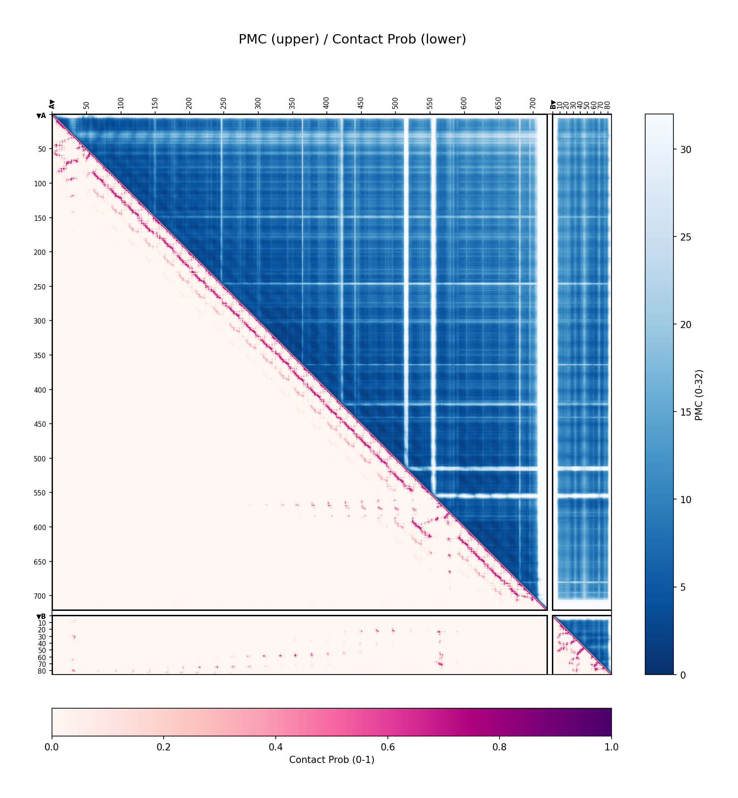
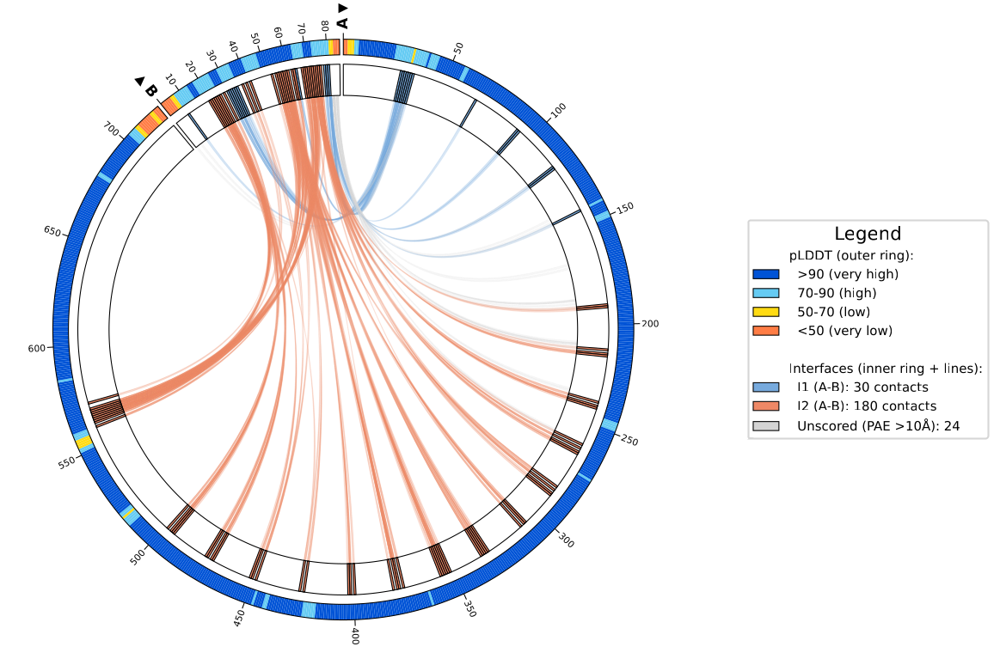

# ipSAE_batch

[](https://colab.research.google.com/github/JKourelis/ipSAE_batch/blob/main/ipSAE_batch_colab.ipynb)

Batch processing of protein structure predictions for interaction scoring and visualization.

Combines **ipSAE** interaction metrics with visualization **inspired by AlphaBridge** for comprehensive analysis of predicted protein complexes from multiple structure prediction backends.

## Important Notes on Implementation

This tool is **inspired by** [ipSAE](https://doi.org/10.1101/2025.02.10.637595) and [AlphaBridge](https://doi.org/10.1101/2024.10.23.619601), but with significant underlying changes:

1. **Multi-backend support**: Unlike AlphaBridge (AF3 only), this implementation works across AlphaFold3, ColabFold/AF2, Boltz2, and IntelliFold.

2. **Calculated contact probabilities**: Since only AF3 provides native contact probabilities, we calculate `contact_prob` from PAE and distance for all backends using: `contact_prob = (1 - pae/31.75) * distance_weight`. Results may differ slightly from native AF3 contact_probs.

3. **Interface detection**: Instead of AlphaBridge's community clustering approach, we use geometric CB-CB distance combined with PAE thresholds to identify interface regions.

4. **Non-protein support**: Extended ipSAE (originally protein-only) to handle DNA, RNA, ligands, and ions with adapted d0 normalization.

## Supported Backends

| Backend | Flag | Description |
|---------|------|-------------|
| AlphaFold3 | `--backend alphafold3` | AF3 server or local outputs |
| ColabFold | `--backend colabfold` | ColabFold/AF2 multimer outputs |
| Boltz2 | `--backend boltz2` | Boltz2 prediction outputs |
| IntelliFold | `--backend intellifold` | IntelliFold server outputs |

## Installation

```bash
# Clone repository
git clone https://github.com/JKourelis/ipSAE_batch.git
cd ipSAE_batch

# Install
pip install -e .
```

**Dependencies:** numpy, matplotlib, pycirclize, igraph, seaborn, scipy, networkx, pandas

## Quick Start

```bash
# Basic processing
ipsae-batch ./data/AF3 --backend alphafold3 --output_dir ./output

# With PNG graphics
ipsae-batch ./data/AF3 --backend alphafold3 --output_dir ./output --png

# ColabFold with custom cutoffs
ipsae-batch ./data/ColabFold --backend colabfold --pae_cutoff 12 --output_dir ./output
```

## Command Line Arguments

| Argument | Description | Default |
|----------|-------------|---------|
| `input_folder` | Folder containing job output folders | Required |
| `--backend` | Structure prediction backend | `alphafold3` |
| `--pae_cutoff` | PAE cutoff for ipSAE calculation | 10 |
| `--dist_cutoff` | Distance cutoff for interface residues (Å) | 10 |
| `--output_dir` | Output directory for results | Same as input |
| `--workers` | Number of parallel workers | CPU cores |
| `--per_residue` | Output per-residue scores | False |
| `--per_contact` | Output per-contact scores | False |
| `--png` | Generate PNG graphics | False |
| `--pdf` | Generate PDF reports | False |
| `--config` | Path to graphics configuration CSV | None |

## Output

### CSV Files

```
output_dir/
├── job1_ipSAE.csv              # Aggregate scores per chain pair
├── job1_ipSAE_byres.csv        # Per-residue scores (--per_residue)
├── job1_ipSAE_contacts.csv     # Per-contact scores (--per_contact)
├── ipSAE_combined.csv          # Combined aggregate results
├── ipSAE_contacts_combined.csv # Combined per-contact results
└── ipSAE_comparison.html       # Interactive batch comparison
```

### Graphics (--png)

```
output_dir/
├── job1_model0_matrix.png      # PMC/Contact probability matrix
├── job1_model0_ribbon.png      # Circular ribbon diagram
└── ...
```

<table>
<tr>
<td width="50%"><b>A) Joint Matrix Plot</b></td>
<td width="50%"><b>B) Ribbon Diagram</b></td>
</tr>
<tr>
<td></td>
<td></td>
</tr>
<tr>
<td>Upper triangle: PMC (Predicted Merged Confidence) or contact probability. Lower triangle: PAE (Predicted Aligned Error). Chain boundaries shown with gaps; ticks indicate residue positions with chain labels (▼) marking N-terminus direction.</td>
<td>Circular representation of protein chains with interface regions. Colored arcs indicate confident interface contacts; grey arcs show contacts below the PAE threshold. Arc thickness reflects contact confidence.</td>
</tr>
</table>

## Interaction Metrics

| Metric | Description | Range | Quality |
|--------|-------------|-------|---------|
| **ipSAE** | Interface Predicted Structural Alignment Error | 0-1 | Higher = better |
| **ipTM** | Interface predicted TM-score | 0-1 | Higher = better |
| **AB_score** | AlphaBridge score = sqrt(contact_prob × ipTM) | 0-1 | Higher = better |
| **contact_prob** | Contact probability | 0-1 | Higher = better |
| **pae** | Predicted Aligned Error | 0-31.75 | Lower = better |
| **pmc** | Predicted Merged Confidence | 0-32 | Lower = better |
| **pDockQ** | Predicted DockQ (pLDDT + contacts) | 0-1 | Higher = better |
| **pDockQ2** | Enhanced pDockQ with PAE | 0-1 | Higher = better |
| **LIS** | Local Interaction Score | 0-1 | Higher = better |

## Non-Protein Chain Support

The original ipSAE publication was designed for **protein-protein interactions only**. This implementation extends ipSAE to support:

| Chain Type | Examples | Support |
|------------|----------|---------|
| **Protein** | Standard amino acids, PTMs | Original behavior |
| **DNA** | DA, DC, DT, DG | Adapted d0 normalization |
| **RNA** | A, C, U, G | Adapted d0 normalization |
| **Ligands** | ATP, small molecules | Supported |
| **Ions** | Mg²⁺, Zn²⁺, Ca²⁺ | Supported |

## Interactive Batch Comparison

The `ipSAE_comparison.html` file provides interactive plots:

- **Scatter Plot**: Compare metrics across jobs with R² trend lines
- **Jitter Plot**: View all models per job to assess consistency
- **Correlation Matrix**: Filter by metric thresholds

All controls are client-side JavaScript (no server required).

## Configuration

Generate a default config file:

```python
from ipsae_batch.graphics.config import create_default_config_csv
create_default_config_csv('graphics_config.csv')
```

Key settings include matrix colormaps, interface thresholds, and output DPI.

## Programmatic Usage

```python
from ipsae_batch.data_readers import get_reader
from ipsae_batch.extractors import extract_pmc, get_geometric_interfaces
from ipsae_batch.extractors.pde import extract_contact_probs
from ipsae_batch.core.scoring import calculate_per_contact_scores
from ipsae_batch.graphics import plot_alphabridge_combined, plot_ribbon

# Read data
reader = get_reader('alphafold3')
result = reader.read_all_models('data/AF3/my_job')[0]

# Pre-compute data
pmc = extract_pmc(result)
contact_probs = extract_contact_probs(result)
contacts = calculate_per_contact_scores(result)
interfaces = get_geometric_interfaces(result, distance_threshold=10.0)

# Generate plots
fig, ax = plot_alphabridge_combined(result, pmc_matrix=pmc, contact_probs=contact_probs)
fig.savefig('matrix.png', dpi=150)

fig = plot_ribbon(result, interfaces=interfaces)
fig.savefig('ribbon.png', dpi=150)
```

## Citation

If you use this tool, please cite:

```
Kourelis (2025). ipSAE_batch: Multi-backend batch processing
for protein interface analysis. https://github.com/JKourelis/ipSAE_batch
[Manuscript in preparation]

Dunbrack, R. L. (2025). ipSAE: A score for confident satisfactory
protein-protein interactions predicted by AlphaFold2 and AlphaFold3.
bioRxiv. https://doi.org/10.1101/2025.02.10.637595

Álvarez-Salmoral, D., et al. (2024). AlphaBridge: tools for the analysis
of predicted biomolecular complexes.
bioRxiv. https://doi.org/10.1101/2024.10.23.619601
```

## License

MIT License
